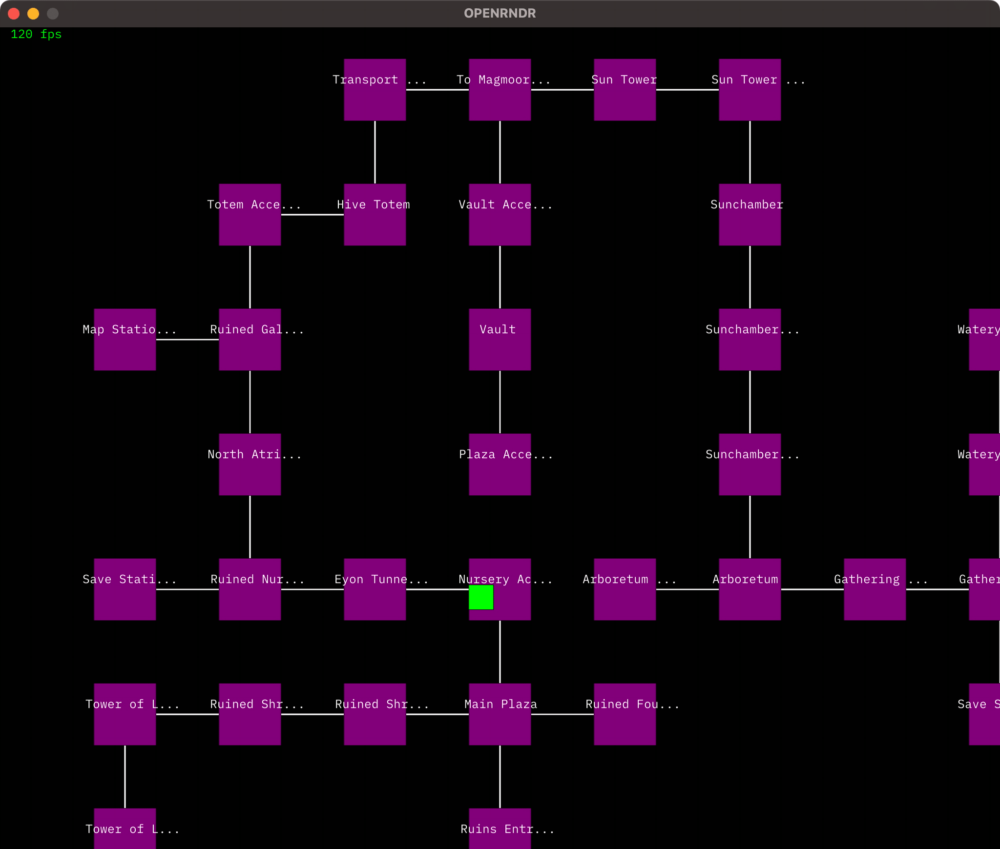

# graphmapnav
Draw a graph defined with the 4 cardinal directions as a map and navigate it. Simple. :smile:

```json
{
  "list": [
    {
      "name": "Main Plaza",
      "edges": [
        {"name": "Nursery Access", "direction": "north"},
        {"name": "Ruined Fountain Access", "direction": "east"},
        {"name": "Ruined Shrine Access", "direction": "west"},
        {"name": "Ruins Entrance", "direction": "south"}
      ]
    }
  ]
}
```

## click things


## zoom in and out


## drag to move around
